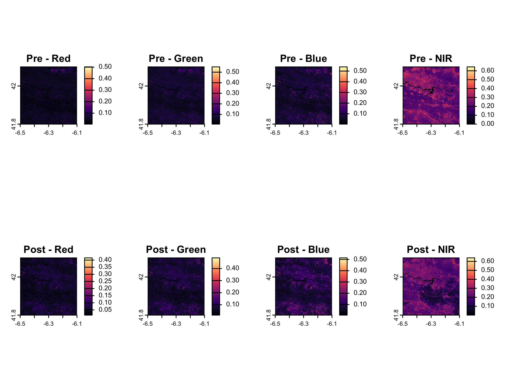

# ANALISI PRE E POST INCENDIO DELLA VEGETAZIONE NELLA SIERRA DE LA CULEBRA(2022) 🌱🔥
### Esame di Telerilevamento Geo-Ecologico in R - 2025
#### Eleonora Zampella

# 1. Introduzione 📑

Nell'estate del 2022 la Spagna è stata colpita da un enorme incendio che colpì principalmente la zona montuosa di Sierra de la Culebra in provincia di Zamora. L'estensione del rogo è stata molto ampia e ha distrutto più di 30.000 ettari di terreno.
La zona, caratterizzata da foreste di pino, quercia e sughera, rappresenta un ecosistema fragile e ad elevato rischio incendi a causa del clima mediterraneo e delle ondate di calore sempre più frequenti.
In questo progetto analizziamo l’impatto dell’incendio sulla vegetazione attraverso immagini satellitari Sentinel-2 in tre momenti temporali:
- Pre-incendio: 25-30 Maggio 2022
- Post-incendio: 5-10 Agosto 2022
- Un anno dopo: 5-10 Agosto 2023
  
Gli indici vegetazionali calcolati sono:
- NDVI (Normalized Difference Vegetation Index) – salute della vegetazione
- DVI (Difference Vegetation Index) – quantità assoluta di vegetazione
- NBR (Normalized Burn Ratio) – evidenzia aree bruciate

<p align="center">
  
</p>

 >  Area di studio(Sierra de la Culebra,Zamora,Spagna)
 
# 2. Obiettivo del progetto 🎯

L'obiettivo del progetto è quello di monitorare i cambiamenti della vegetazione nel tempo, quantificare l’impatto dell’incendio e osservare il recupero vegetazionale un anno dopo, attraverso il calcolo di indici spettrali e analisi multitemporale.

# 3. Metodologia🛰️ 

## Raccolta delle immagini📂 

Le immagini satellitari provengono da [**Google Earth Engine**](https://earthengine.google.com/) selezionando l'area dell'incendio e le date indicate.
> [!NOTE]
> Il codice JavaScript utilizzato è quello fornito durante il corso ed è disponibile nel file Codice.js

## Importazione e visualizzazione delle immagini 💻 
Una volta ottenute le immagini satellitari le carichiamo su R impostando una working directory:

````r
setwd("~/Desktop/TELERILEVAMENTO_R")
````
Successivamente sono stati installati i seguenti pacchetti in R

````r
library(terra)      # Per lavorare con raster e immagini satellitari
library(imageRy)    # Funzioni di visualizzazione rapide
library(viridis)    # Palette di colori
library(ggplot2)    # Pacchetto per la creazione di grafici
library(reshape2)   # Riorganizzazioni dei dati tabellari 
````

A questo punto impostiamo i raster Sentinel-2 : 

````r
pre=rast("PreIncendio_Maggio2022.tif") # Ho importato la prima immagine e l’ho nominata
plot(pre) # Per visualizzare l'immagine importata
````

<p align="center">
  
</p>

> Immagine prima dell'incendio nelle 5 bande

````r
post=rast("PostIncendio_Agosto2022.tif") # Ho importato la seconda immagine e l'ho nominata
plot(post) # Per visulizzare la seconda immagine
````
<p align="center">
  
</p>

> Immagine dopo l'incendio nelle 5 bande

## Visualizzazione delle immagini in RGB 🌈

````r
im.multiframe(1,2) # Visualizzare un pannello grafico con 1 riga e 2 colonne 
im.plotRGB(pre, r = 1, g = 2, b = 3, title = "Pre-incendio")  # Visualizzare l'immagine a veri colori 
im.plotRGB(post, r = 1, g = 2, b = 3, title = "Post-incendio") # Visualizzare l'immagine a veri colori 
dev.off() # Chiudere il pannello di Visualizzazione delle immagini
````
<p align="center">
  
</p>

> Dalle immagini è visibile la differenza tra il prima e il dopo l'incendio 

## Visualizzazione delle quattro bande separate per entrambe le immagini (RGB + NIR) 🎨

````r
im.multiframe(2,4) # Visualizzare un pannello grafico con 2 righe e 4 colonne
plot(pre[[1]], col = magma(100), main = "Pre - Red") 
plot(pre[[2]], col = magma(100), main = "Pre - Green")
plot(pre[[3]], col = magma(100), main = "Pre - Blue")
plot(pre[[4]], col = magma(100), main = "Pre - NIR")

plot(post[[1]], col = magma(100), main = "Post - Red")
plot(post[[2]], col = magma(100), main = "Post - Green")
plot(post[[3]], col = magma(100), main = "Post - Blue")
plot(post[[4]], col = magma(100), main = "Post - NIR")
dev.off() # Chiudere il pannello di visualizzazione delle immagini
````
> [!NOTE]
> Viene specificata la banda, il colore e il titolo
 
<p align="center">
  
</p>

> **COMMENTO**
>
> Le bande **RGB** (red,green,blue) mostrano la vegetazione visibile, mentre la banda **NIR** (Near Infrared / Infrarosso vicino, B8) evidenzia la vegetazione sana. Pre-incendio la **NIR** è chiara (vegetazione rigogliosa), post-incendio diventa scura, indicando un calo significativo della vegetazione.

# 4. Calcolo degli indici vegetazionali 📈

## Indice NBR (Normalized Burn Ratio) 🔥
- Formula: (NIR - SWIR2) / (NIR + SWIR2)
- L'indice sfrutta la banda NIR (B8) sensibile alla vegetazione sana e la banda SWIR2 (B12) sensibile all’umidità e alle superfici bruciate.
- Evidenzia le **aree bruciate o danneggiate da incendi**.
- Valori bassi indicano vegetazione compromessa o terreno bruciato. 

````r
nbr_pre = (pre[["B8"]] - pre[["B12"]]) / (pre[["B8"]] + pre[["B12"]]) # Calcolo NBR pre-incendio
nbr_post = (post[["B8"]] - post[["B12"]]) / (post[["B8"]] + post[["B12"]]) # Calcolo NBR post-incendio
dnbr = nbr_pre - nbr_post # Differenza NBR (dNBR)
````

````r
im.multiframe(1,3)  #  Visualizzazione di un pannello grafico con 1 righe e 3 colonne
plot(nbr_pre, main="NBR Pre", col=viridis::viridis(100)) # Visualizzazione NBR pre-incendio
plot(nbr_post, main="NBR Post", col=viridis::viridis(100)) # Visualizzazione NBR post-incendio
plot(dnbr, main="dNBR", col=viridis::inferno(100)) # Visualizzazione della differenza NBR-Evidenzia l'impatto dell'incendio: valori positivi indicano perdita di vegetazione
dev.off()  # Chiudere il pannello di visualizzazione delle immagini
````
<p align="center">
  
</p>

 > **COMMENTO**
 >
 > Prima dell'incendio si osservano valori più elevati coerenti con la vegetazione viva e rigogliosa;
 >  
 > Dopo l'incendio i valori si riducono nelle aree bruciate, evidenziando la perdita di vegetazione;
 > 
 > La mappa differenziale mette in evidenza l’impatto del fuoco: valori positivi corrispondono a zone dove la vegetazione è stata compromessa, permettendo di localizzare e quantificare le aree più danneggiate.

## Indice DVI (Difference Vegetation Index) 🌿
- L’indice DVI (Difference Vegetation Index) è calcolato come differenza tra la riflettanza nel vicino infrarosso (NIR, banda B8) e quella nel rosso (RED, banda B4).
- Formula: NIR - RED
- Misura la **quantità assoluta di vegetazione** senza normalizzazione.
- Valori elevati indicano presenza abbondante di vegetazione.

````r
dvi_pre = pre[["B8"]] - pre[["B4"]] # Calcolo DVI pre-incendio
dvi_post = post[["B8"]] - post[["B4"]] # Calcolo DVI post-incendio
ddvi =dvi_pre - dvi_post # Differenza DVI
````

````r
im.multiframe(1,3)
plot(dvi_pre, main = "DVI Pre", col=viridis::viridis(100)) # Visualizzazione DVI pre-incendio 
plot(dvi_post, main = "DVI Post", col=viridis::viridis(100)) # Visualizzazione DVI post-incendio 
plot(ddvi, main = "ΔDVI", col=viridis::inferno(100)) # Visualizzazione della differenza DVI pre e post incendio 
dev.off()
````
<p align="center">
  
</p>

> **COMMENTO**
>
> Nell' **DVI Pre** la scala va dal viola scuro (bassa riflettanza NIR) al giallo brillante (alta riflettanza NIR). Le zone verdi-gialle indicano vegetazione abbondante e sana.
>
> Nell' **DVI Post** le aree verdi-gialle diventano viola-blu scuro, indicando una drastica perdita di vegetazione a causa dell’incendio.
>
> Nell'**ΔDVI** osserviamo le zone colorate di viola scuro mostrano il massimo danno alla vegetazione, mentre le aree arancioni chiare indicano cambiamenti meno significativi. L’immagine mette in evidenza chiaramente le aree più colpite dall’incendio e quelle dove la vegetazione è stata meno danneggiata.

## Indice NDVI (Normalized Difference Vegetation Index) 🍃
- Formula: (NIR - RED) / (NIR + RED)
- Indica la **salute della vegetazione**.
- Valori vicini a 1: vegetazione sana e rigogliosa.
- Valori vicini a 0 o negativi: suolo nudo, acqua o aree degradate.

````r
ndvi_pre = (pre[["B8"]] - pre[["B4"]]) / (pre[["B8"]] + pre[["B4"]]) # Calcolo NDVI pre-incendio 
ndvi_post = (post[["B8"]] - post[["B4"]]) / (post[["B8"]] + post[["B4"]]) # Calcolo NDVI post-incendio 
dndvi = ndvi_pre - ndvi_post #differenza NDVI
````
````r
im.multiframe(1,3)  #  Visualizzazione di un pannello grafico con 1 righa e 3 colonne
plot(ndvi_pre, main="NDVI Pre", col=viridis::viridis(100))   #  Visualizzazione NDVI prima dell'incendio
plot(ndvi_post, main="NDVI Post", col=viridis::viridis(100)) # Visualizzazione NDVI dopo l'incendio
plot(dndvi, main="ΔNDVI", col=viridis::inferno(100))        # Visualizzazione differenza NDVI (impatto incendio)
dev.off() # Chiudere il pannello di visualizzazione delle immagini
````
<p align="center">
  
</p>

> **COMMENTO**
>
> Nell' **NDVI Pre** i valori alti (vicino a 1) indicano vegetazione sana, mentre valori bassi o negativi rappresentano acqua, suolo nudo o rocce. La mappa mostra vegetazione diffusa, con corsi d’acqua visibili nei valori bassi (colore nero/blu).
>
> Nell' **NDVI Post** i valori calano in tutta l’area, indicando perdita di vegetazione e danni causati dall’incendio. L’area appare meno verde e più spenta.
>
> Nell'**ΔNDVI** le zone viola scuro e nere indicano massimo danno, mentre le aree arancioni evidenziano cambiamenti meno severi. La mappa mostra chiaramente le zone più e meno colpite dall’incendio.

# 5. Analisi Multitemporale⏳

## Classificazione NDVI 🗂️

````r
soglia = 0.3 # Soglia NDVI per distinguere vegetazione/non vegetazione
classi_pre=classify(ndvi_pre,  rcl=matrix(c(-Inf,soglia,0, soglia,Inf,1), ncol=3, byrow=TRUE))
classi_post=classify(ndvi_post, rcl=matrix(c(-Inf,soglia,0, soglia,Inf,1), ncol=3, byrow=TRUE))
````
> Ho scelto la soglia NDVI = 0.3 per distinguere vegetazione e non-vegetazione, in quanto valori inferiori a 0.3 indicano generalmente suolo nudo o aree degradate, mentre valori superiori corrispondono a vegetazione attiva e sana.

## Visualizzazione delle classi 👁️

````r
im.multiframe(1,2)
plot(classi_pre,  main="Classi NDVI Pre",  col=c("red","darkgreen"))
plot(classi_post, main="Classi NDVI Post", col=c("red","darkgreen"))
dev.off()
````
<p align="center">
  
</p>

> **COMMENTO**
>
> La prima immagine  mostra che la maggior parte dell'area era coperta da vegetazione (verde). Le zone rosse corrispondono principalmente a fiumi, specchi d'acqua o aree urbane preesistenti.
>
> La seconda immagine mostra che una vasta area al centro e a destra è passata dal verde al rosso. Questo indica che la vegetazione è stata rimossa o distrutta su larga scala.

## Calcolo frequenze percentuali 📊
Per quantificare quanto terreno è coperto da vegetazione e non-vegetazione

````r
freq_pre = freq(classi_pre)   # conta i pixel per ogni classe NDVI pre
freq_post = freq(classi_post)  # conta i pixel per ogni classe NDVI post
````

````r
perc_pre = freq_pre$count  * 100 / ncell(classi_pre)
perc_post = freq_post$count * 100 / ncell(classi_post)
````

## Creazione tabella riassuntiva 📝
````r
NDVI_classi = c("Non vegetazione", "Vegetazione")
tabella = data.frame(
  Classe = NDVI_classi,
  Pre_incendio  = round(perc_pre, 2),
  Post_incendio = round(perc_post, 2)
)

print(tabella)  # visualizzazione tabella
````
 | Classe         | Pre_incendio | Post_incendio |
|----------------|-------------:|--------------:|
| Non vegetazione|       7.00 % |       46.36 % |
| Vegetazione    |      92.96 % |       53.59 % |


## Grafico comparativo 📉

````r
df_long = melt(tabella, id.vars = "Classe",                                              # Converte la tabella in formato lungo 
                variable.name = "Periodo",
                value.name = "Percentuale")


ggplot(df_long, aes(x=Classe, y=Percentuale, fill=Periodo)) +                            # Crea Grafico assegnando X, Y e colore
 geom_bar(stat="identity", position="dodge") +                                           # Barre affiaancate per confrontare i periodi
  geom_text(aes(label=round(Percentuale,1)),                                             # Aggiunge i valori sulle barre  
            position=position_dodge(width=0.9),                                          # Allinea il testo sulle barre affiancate
            vjust=-0.25,size=3) +                                                        # Sposta leggermente sopra le barre
  scale_fill_viridis_d() +                                                               # Applica la palette di colori 'viridis'
  ylim(0,100) +                                                                          # Limiti asse Y 0-100%
  labs(title="Copertura vegetazione (NDVI > 0.3)",                                       # Titoli ed etichette
       subtitle="Percentuale di vegetazione e non vegetazione prima e dopo l'incendio",
       y="Percentuale (%)", x="Classe NDVI") +
  theme_minimal()                                                                        # Tema pulito
````
<p align="center">
  
</p>

# 6. Analisi a un anno dall’incendio (Agosto 2023) 🌿🕒�
Per osservare lo stato della vegetazione un anno dopo è stata scaricata un'immagine satellitare attraverso il codice JavaScript utilizzato in precedenza su GEE
E' stata cambiata la data aggiornandola a quella del 2023 (dal 5/08/2023 al 10/08/23)
Sono stati eseguiti gli stessi passaggi usati in precedenza

````r
setwd("~/Desktop/TELERILEVAMENTO_R") # Per impostare la working directory
post2023=rast("PostIncendio_Agosto2023.tif") # Ho impostato l'immagine e nominata
plot(post2023) # Ho scaricato l'immagine 
````
<p align="center">
  
</p>

> Immagine dopo un anno nelle 5 bande

## Calcolo gli indici (DVI e NDVI) anche per l'anno 2023 📊
````r
dvi_post2023 = post2023[["B8"]] - post2023[["B4"]]
ndvi_post2023 = (post2023[["B8"]] - post2023[["B4"]]) / (post2023[["B8"]] + post2023[["B4"]])
im.multiframe(1,2)
plot(dvi_post2023,main = "DVI Post-incendio 2023",col = inferno(100),axes = TRUE)
plot(ndvi_post2023,main = "NDVI Post-incendio 2023",col = inferno(100),axes = TRUE)
dev.off()
````
<p align="center">
  
</p>

> **COMMENTO**
>
> La prima immagine ci mostra l'indice **DVI** che presenta valori bassi suggerendo che la biomassa vegetale non si è ancora completamente ripresa. La vegetazione, quindi, è principalmente erbe e arbusti ancora lontana dai livelli pre-incendio.
>
> La seconda immagine ci mostra l'indice **NDVI** che presenta valori più alti rispetto al post-incendio indicano una parziale ricrescita della vegetazione, con le prime aree verdi che mostrano segni di recupero.

## Allineamento raster (con resample() sulla griglia pre-incendio, per garantire che ogni pixel corrisponda esattamente alla stessa area geografica.) 🗺️
````r
ndvi_post2023_aligned = resample(ndvi_post2023, ndvi_post, method="bilinear")
dvi_post2023_aligned = resample(dvi_post2023, dvi_post, method="bilinear")
````

## Calcolo differenze 
````r
ddvi_2022 = dvi_pre - dvi_post
ddvi_2023 = dvi_post - dvi_post2023_aligned
dndvi_2022 = ndvi_pre - ndvi_post          # Pre vs post incendio 2022
dndvi_2023 = ndvi_post - ndvi_post2023_aligned  # Post 2022 vs post 2023
````

## Visualizzazione affiancata 
## DVI 🌿
````r
im.multiframe(2,3)  # 2 righe x 3 colonne
plot(dvi_pre, main="DVI Pre-incendio 2022", col=viridis(100))
plot(dvi_post, main="DVI Post-incendio 2022", col=viridis(100))
plot(dvi_post2023_aligned, main="DVI Post 2023", col=viridis(100))
plot(ddvi_2022, main="ΔDVI Pre vs Post 2022", col=inferno(100))
plot(ddvi_2023, main="ΔDVI Post 2022 vs 2023", col=inferno(100))
dev.off()
````
<p align="center">
  
</p>

> **COMMENTO**
>
> La **riga superiore** mostra un crollo del verde nel DVI Post-incendio 2022, seguito da una leggera ricrescita nel 2023, pur senza raggiungere i livelli pre-evento.
>
> La **riga inferiore** mostra la differenza tra i vari periodi. Nell' **ΔDVI Pre vs Post 2022** le aree più scure (viola-nero) indicano la massima distruzione della vegetazione. Nell'**ΔDVI Post 2022 vs 2023** i colori arancioni e gialli rappresentano un aumento del valore DVI, indicando una positiva, seppur parziale, ripresa della vegetazione.

## NDVI 🍃
````r
im.multiframe(2,3)  # 2 righe x 3 colonne
plot(ndvi_pre, main="NDVI Pre-incendio 2022", col=viridis(100))
plot(ndvi_post, main="NDVI Post-incendio 2022", col=viridis(100))
plot(ndvi_post2023_aligned, main="NDVI Post 2023", col=viridis(100))
plot(dndvi_2022, main="ΔNDVI Pre vs Post 2022", col=inferno(100))
plot(dndvi_2023, main="ΔNDVI Post 2022 vs 2023", col=inferno(100))
````
 <p align="center">
  
</p>

> **COMMENTO**
>
> La **riga superiore** ci mostra come dalla vegetazione sana inziale(colore giallo e verde) ci sia stata una perdita significatica di biomassa con l'incendio fino ad arrivare ad una ricrescita della vegetazione ad un anno dall'incendio (colori sono più gialli e verdi)
>
> La **riga inferiore** ci mostra la differenza tra le mappe per quantificare il cambiamento avvenuto. Osserviamo all'inizio aree nere e viola scuro indicano la distruzione massima della vegetazione causata dall'incendio, successivamente i colori arancioni e gialli indicano un aumento dell'NDVI, a testimonianza di una ripresa positiva dell'ecosistema.

## Analisi classificazione NDVI 🗂️
````r
soglia = 0.3
classi_pre = classify(ndvi_pre,  rcl=matrix(c(-Inf,soglia,0, soglia,Inf,1), ncol=3, byrow=TRUE))
classi_post = classify(ndvi_post, rcl=matrix(c(-Inf,soglia,0, soglia,Inf,1), ncol=3, byrow=TRUE))
classi_post2023 = classify(ndvi_post2023_aligned, rcl=matrix(c(-Inf,soglia,0, soglia,Inf,1), ncol=3, byrow=TRUE))
````

## Frequenze percentuali 📊
````r
freq_pre = freq(classi_pre)  # Utilizzo il useNA perchè non voglio contare i pixel che hanno valore mancante NA (mi interessano solo classi 0 senza vegetaioni e 1 con vegetazione)
freq_post = freq(classi_post)
freq_post2023 = freq(classi_post2023)

perc_pre = freq_pre$count  * 100 / ncell(classi_pre)
perc_post = freq_post$count * 100 / ncell(classi_post)
perc_post2023 = freq_post2023$count * 100 / ncell(classi_post2023)
````

## Percentuale di copertura vegetale e non vegetale nelle diverse date considerate: pre-incendio (maggio 2022), post-incendio (agosto 2022) e un anno dopo (agosto 2023) 📉

````r
tabella = data.frame(
  Classe = c("Non vegetazione", "Vegetazione"),
  Pre_incendio = round(perc_pre,2),
  Post_incendio = round(perc_post,2),
  Post_2023 = round(perc_post2023,2)
)  
print(tabella) # Per la visualizzazione della tabella
````
| Classe         | Pre_incendio | Post_incendio | Post_2023 |
|----------------|-------------:|--------------:|----------:|
| Non vegetazione|       7.00 % |       46.36 % |   31.10 % |
| Vegetazione    |      92.96 % |       53.59 % |   68.85 % |


## Grafico comparativo con ggplot2 📉

````r
df_long = melt(tabella, id.vars="Classe",                       # Converte la tabella in formato lungo per ggplot                                       variable.name="Periodo",
                value.name="Percentuale")

ggplot(df_long, aes(x=Classe, y=Percentuale, fill=Periodo)) +   # Crea Grafico assegnando X, Y e colore
  geom_bar(stat="identity", position="dodge") +                 # Barre affiaancate per confrontare i periodi
  geom_text(aes(label=round(Percentuale,1)),                    # Aggiunge i valori sulle barre
            position=position_dodge(width=0.9),                 # Allinea il testo sulle barre affiancate
            vjust=-0.25,                                        # Sposta leggermente sopra le barre
            size=3) +                                           # Dimensione testo
  scale_fill_manual(values = c("Pre_incendio" = "darkorchid4",  # Colori distinti per i periodi
                               "Post_incendio" = "yellow",
                               "Post_2023" = "orange"))                                       
  ylim(0,100) +                                                 # Limiti asse Y 0-100%
  labs(title="Copertura vegetazione (NDVI > 0.3)",              # Titoli ed etichette
       y="Percentuale (%)", x="Classe NDVI") +
  theme_minimal()                                               # Tema pulito
````
<p align="center">
  
</p>

# 7. Conclusioni 📝
In conclusione possiamo affermare che attraverso questa analisi condotta sulla Sierra de la Culebra si osserva chiaramente l’impatto devastante dell’incendio del 2022 sulla vegetazione. I valori di NDVI e DVI hanno mostrato un forte calo nelle aree colpite, segnalando una significativa perdita di biomassa vegetale, mentre l’indice NBR ha permesso di individuare con precisione le zone bruciate. La classificazione NDVI ha confermato che la percentuale di vegetazione è passata dal 92,96% al 53,59%, mentre le aree non vegetate sono aumentate dal 7% al 46,36%. Ad un anno dopo l'incendio i dati indicano un recupero parziale della vegetazione. I valori di NDVI e DVI mostrano un aumento rispetto al periodo post-incendio immediato, evidenziando una rigenerazione principalmente di erbe e arbusti, con la percentuale di vegetazione che risale al 68,85% e le aree non vegetate che scendono al 31,10%. Tuttavia, alcune zone restano degradate, suggerendo che il recupero completo sarà più lento. 
L’analisi multitemporale dimostra l’efficacia del telerilevamento nel monitoraggio dei cambiamenti ambientali, fornendo una visione sia dell’impatto immediato sia delle dinamiche di recupero della vegetazione. I risultati evidenziano chiaramente le aree più colpite e il progresso della rigenerazione, offrendo informazioni fondamentali per future strategie di gestione e recupero ecologico.

# Grazie per l'attenzione! 😃 
